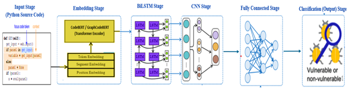

# DeepSecure — Vulnerability Detection with Deep Learning on Python Code

DeepSecure is a hybrid deep learning framework for detecting security vulnerabilities in Python source code. It combines **GraphCodeBERT + BiLSTM + CNN** to classify code windows as vulnerable or clean across six vulnerability types.

The framework achieves a macro-F1 of **96.93%**, outperforming prior baselines by +11.16 percentage points.


## Background

DeepSecure follows the same commit-based weak supervision methodology as VUDENC: if a code snippet was changed in a commit with a message like *"fix sql injection issue"*, the changed code is assumed to have been vulnerable before the fix.

Unlike VUDENC (which uses Word2Vec + LSTM), DeepSecure replaces the embedding and classification pipeline with a hybrid of:
- **GraphCodeBERT** — pre-trained transformer capturing code structure and data flow
- **BiLSTM** — bidirectional sequential modeling over token embeddings
- **CNN** — multi-scale local feature extraction via parallel convolutional filters

The model operates on sliding windows of fixed length (200 characters, step 5) extracted from source files, labeling each window based on whether it overlaps with a vulnerable code region.


## Architecture

<p align="center">
  
</p>

The framework processes Python source code through five sequential stages: Input (sliding window segmentation) → Embedding (CodeBERT/GraphCodeBERT transformer encoder) → BiLSTM (bidirectional sequential modeling) → CNN (multi-scale local feature extraction) → Fully Connected + Sigmoid (binary classification: vulnerable / non-vulnerable).


## Vulnerability Types

| Vulnerability | Dataset Source |
|---|---|
| SQL Injection | VUDENC (Wartschinski et al., 2022) |
| XSS | VUDENC |
| Command Injection | VUDENC |
| Remote Code Execution | VUDENC |
| **Broken Authentication** | **This work (novel dataset)** |
| **Hard-coded Credentials** | **This work (novel dataset)** |

**Datasets:** The novel datasets (Broken Authentication and Hard-coded Credentials) are publicly available on Zenodo:
https://doi.org/10.5281/zenodo.19152451


## Code

### 1. Data Collection

To collect data for a new vulnerability type, a GitHub API access token is required.
Create one at: https://github.com/settings/tokens
Save it in a file called `access` in the same folder as the scripts.

**Step 1.1** — Scrape security-related commits from GitHub:
```
python3 data_collection/broken_authentication/scrapingGithub.py
```
Results are saved in `all_commits.json`.

**Step 1.2** — Filter out showcase and CTF repositories:
```
python3 data_collection/broken_authentication/filterShowcases.py
```
Results are saved in `DataFilter.json`.

**Step 1.3** — Download diff files and identify Python commits:
```
python3 data_collection/broken_authentication/getDiffs.py
```
Results are saved in `PyCommitsWithDiffs.json`.

**Step 1.4** — Extract source code, labels, and build the plain dataset:
```
python3 data_collection/broken_authentication/getData.py
```
Results are saved in `data/plain_broken_authentication.json`.

Repeat the same steps using `data_collection/hardcoded_credentials/` for Hard-coded Credentials.

For SQL Injection, XSS, Command Injection, and RCE — download the original VUDENC datasets from:
https://zenodo.org/record/5903630


### 2. Training the DeepSecure Model

**Step 2.1** — Build sliding windows and split data (70/15/15):
```
python3 scripts/makemodel_CodeBERT.py
```
Environment variables:
```
MODE=sql            # vulnerability type: sql, xss, command_injection, rce, broken_authentication, use_of_hardcoded_credentials
SEED=42             # data split seed (fixed across all training runs)
FULL_LENGTH=200     # window size in characters
STEP=5              # sliding step
```

**Step 2.2** — Tokenize using GraphCodeBERT:
```
python3 scripts/tokenize_CodeBERT.py
```
Environment variables:
```
BACKBONE=microsoft/graphcodebert-base
MAX_SEQ_LEN=200
```

**Step 2.3** — Train the hybrid model:
```
python3 scripts/train_CodeBERT_BiLSTM_CNN.py
```
Environment variables:
```
SEED=42             # training seed (controls weight initialization and dropout)
EPOCHS=100
BATCH_SIZE=128
LR=1e-5
```
The best checkpoint is saved to `checkpoints/best_{BASE}.pt`.

**Step 2.4** — Validate on the validation split:
```
python3 scripts/validate_CodeBERT_BiLSTM_CNN.py
```
Outputs: ROC curve, PR curve, calibration curve, confusion matrix, ECE score.

**Step 2.5** — Evaluate on the final test split:
```
python3 scripts/test-CodeBERT_BiLSTM_CNN.py
```
Results saved to `results/final_test_results_{BASE}.json`.


### 3. Multi-Seed Evaluation

The paper reports results over five independent training runs with seeds {7, 42, 99, 123, 2025}.

The data split (makemodel + tokenize) is performed **once** with SEED=42 and reused across all training seeds. Only the training seed changes between runs, varying weight initialization and dropout stochasticity.


## Experimental Results

DeepSecure was evaluated through four structured experimental phases designed to assess effectiveness, robustness, and generalization.

### Phase 1 — Comparison with Prior Work

Compares DeepSecure against established baselines including VUDENC and Bagheri & Hegedus (2021).

- **Objective:** Evaluate overall detection performance across all six vulnerability types
- **Metrics:** Macro-F1, Precision, Recall, ROC-AUC, ECE
- **Location:** `results/phase1_compare_backbones/`

| Model | Macro-F1 | ECE |
|---|---|---|
| VUDENC (Wartschinski et al., 2022) | 85.77% | — |
| Bagheri & Hegedus (2021) | 85.77% | — |
| **DeepSecure (GraphCodeBERT + BiLSTM + CNN)** | **96.93%** | **0.1902** |

### Phase 2 — Ablation Study

Analyzes the contribution of each pooling strategy (CLS, Mean, BiLSTM+CNN) on SQL Injection and XSS independently.

- **Objective:** Confirm BiLSTM+CNN advantage in-distribution
- **Configurations:** CLS pooling, Mean pooling, BiLSTM+CNN pooling
- **Location:** `results/phase2_ablation/`

### Phase 3 — Hyperparameter Optimization

Sequential tuning of key hyperparameters on SQL Injection, validated on XSS.

- **Objective:** Identify optimal training configuration
- **Parameters:** Learning rate, LSTM hidden size, CNN filters/kernels, dropout, batch size
- **Location:** `results/phase3_hyperparameter_opt/`

### Phase 4 — Multi-Seed Evaluation

Evaluates model stability across five independent training runs with fixed data partition.

- **Objective:** Assess robustness and reproducibility
- **Seeds:** {7, 42, 99, 123, 2025} — training seeds only (data split fixed at seed=42)
- **Location:** `results/phase4_five_seeds/`

### Summary

- Macro-F1: **96.93%** (+11.16pp over baselines)
- Calibration ECE: **0.1902** (macro-average)
- Stability: **CV% < 0.5%** across all seeds and vulnerability types

All detailed outputs, logs, plots, and evaluation artifacts are in the corresponding `results/` subdirectories.


## Hardware & Software Environment

**Hardware (Table 6.10):**

| Component | Specification |
|---|---|
| GPU | NVIDIA A100 40GB SXM4 |
| GPU Architecture | Ampere (Compute Capability 8.0) |
| CUDA Cores | 6,912 |
| Memory Bandwidth | 1,555 GB/s |
| System RAM | 83 GB |
| CPU | Intel Xeon (variable allocation) |
| Operating System | Ubuntu 22.04 LTS |
| Platform | Google Colab Pro |

**Software Dependencies (Table 6.9):**

| Component | Version | Purpose |
|---|---|---|
| Python | 3.12.0 | Runtime environment |
| PyTorch | 2.1.0+cu121 | Deep learning framework |
| Transformers | 4.35.0 | Pre-trained models (GraphCodeBERT) |
| Tokenizers | 0.15.0 | Fast tokenization |
| scikit-learn | 1.3.2 | Evaluation metrics |
| NumPy | 1.26.1 | Numerical operations |
| Pandas | 2.1.3 | Data manipulation |
| Matplotlib | 3.8.0 | Visualization |
| CUDA | 12.1 | GPU acceleration |
| cuDNN | 8.6.0 | Deep neural network primitives |


## Installation

```
git clone https://github.com/ReemAbdulrzaqAlmutairi/DeepSecure.git
cd DeepSecure
pip install -r requirements.txt
```


## Attribution

The data collection pipeline (`data_collection/`) and utility functions (`src/myutils.py`) are adapted from VUDENC:

> Wartschinski, L., Noller, Y., Vogel, T., Kehrer, T., & Grunske, L. (2022).
> VUDENC: Vulnerability Detection with Deep Learning on a Natural Codebase.
> Information and Software Technology, 144, 106809.
> https://github.com/LauraWartschinski/VulnerabilityDetection

Modifications: keyword sets updated for Broken Authentication and Hard-coded Credentials; library compatibility updates; code modernization.

The DeepSecure model architecture and all experimental scripts are original work by the authors.


## Colab Execution Notes

All experiments were executed in Google Colab Pro under `/content/codebert`, with scripts stored in the `scripts/` directory and outputs organized under `data/`, `results/`, `plots/`, `checkpoints/`, and `artifacts/`.

The preprocessing split was generated **once** with `SEED=42` using `makemodel_CodeBERT.py` and `tokenize_CodeBERT.py`, and the same fixed split was reused across all five training runs. For multi-seed evaluation, only the training seed was varied ({7, 42, 99, 123, 2025}), while the data partition remained identical.


## Data Availability

The datasets used in this study are publicly available on Zenodo (DOI):
https://doi.org/10.5281/zenodo.19152451

The source code is available on GitHub:
https://github.com/ReemAlmutairi/DeepSecure


## License

Code: MIT License
Novel datasets (Broken Authentication, Hard-coded Credentials): CC BY 4.0


Contact: Reem A. Almutairi — r.almotiri@mu.edu.sa
